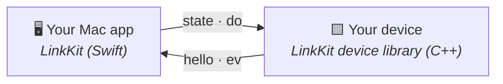

<h1 align="center">📡 LinkKit</h1>

<p align="center">
  <b>Your Mac app, meet your little gadget. Over Bluetooth or USB.</b>
</p>

<p align="center">
  
  
  
  
  
</p>

You built a gadget: a status light, a tiny screen with a face, a buzzer
that judges you. Now your Mac app needs to talk to it without you
inventing yet another protocol. LinkKit is the whole conversation:



- ✉️ **Four JSON messages.** The Mac says how things are (`state`) and
  asks for things to play (`do`). The device says who it is (`hello`)
  and what happened (`ev`).
- 🎬 **The device decides when.** Requests wait their turn behind
  whatever's playing, and every one gets exactly one answer: done, cut
  or skipped.
- 🔌 **Bluetooth or USB, same messages.** A USB bridge shares the board
  with your app and your tools at once.
- 🧪 **Runs on a Mac too.** The device library's core has no Arduino
  headers, so its tests and simulators run anywhere.

## Quick start

You need Swift 6 (Xcode or the Command Line Tools) on macOS 13 or later,
and PlatformIO for the device side. Run each side's tests:

```sh
cd linkkit
swift test --scratch-path .build/tests   # the Swift host
pio test -d device -e native             # the C++ device library
```

Then add the host library to your app's `Package.swift`:

```swift
.package(path: "../linkkit"),
// and in a target's dependencies:
.product(name: "LinkKit", package: "linkkit"),
```

The device library's README has a whole lamp that fits on a page.

## Learn more

- **[ARCHITECTURE.md](ARCHITECTURE.md)**: the four messages, the turn,
  and driving a lamp from Swift.
- **[device/README.md](device/README.md)**: the C++ side, and how your
  app plugs into it.
- **[SPEC.md](SPEC.md)**: every message and rule, exactly.

It was pulled out of Boop, a desk creature that watches your coding
agents; Boop's app and firmware both run on it. MIT-licensed
([LICENSE](LICENSE)).
